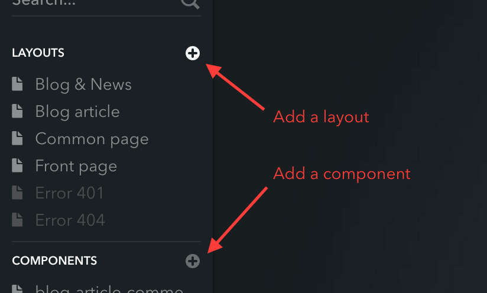
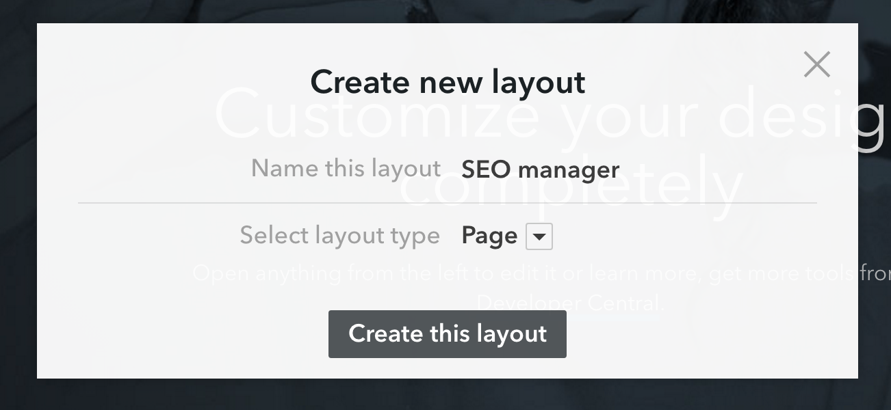
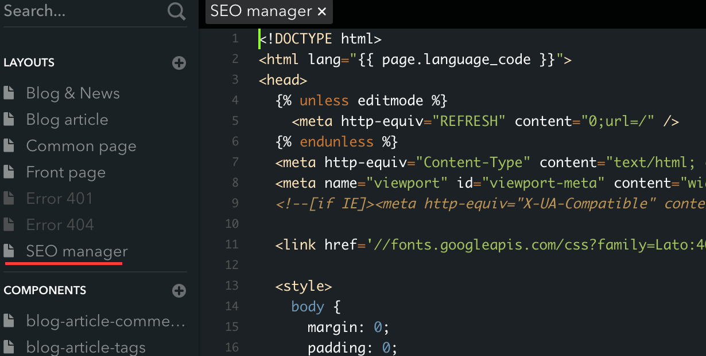
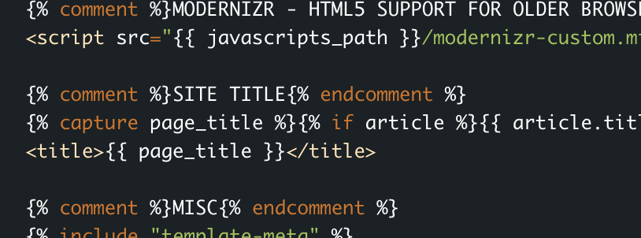
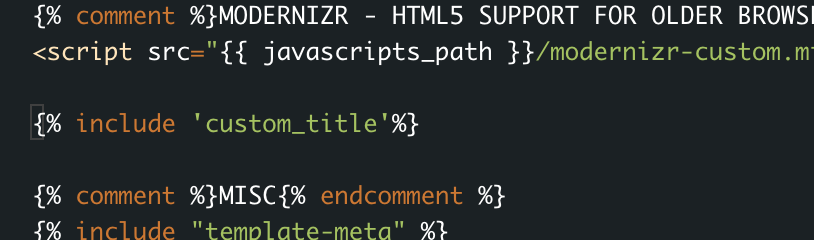
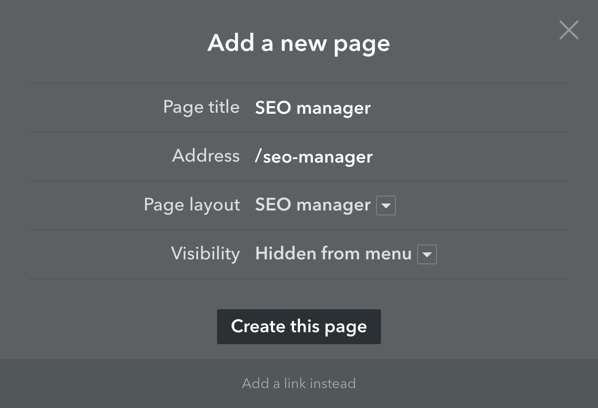
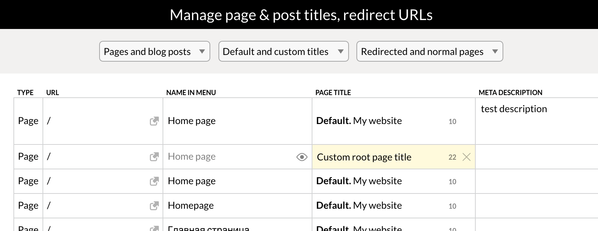

# Voog SEO manager

## What is it?
This is a custom Voog layout to help with managing all your site's pages and (some of) their SEO-critical attributes.

Currently it allows changing the following attributes for pages and blog posts:

* path
* name/title (shown in menu)
* title (used for &lt;title&gt; tag)
* visibility / published status
* description
* permanent redirect (for pages only)

## How do I use it?
To add the tool to your own site, you need to follow these few steps:

1. Customize your site's design template — [here's a guide](https://www.voog.com/support/guides/your-websites-design/getting-a-fully-customized-design).

2. Open your design editor from Settings -> Template editor (/admin/designs/editor)

3. Create a new layout, paste the contents of [page_manager.tpl](https://raw.githubusercontent.com/Voog/seo-manager/master/layouts/page_manager.tpl) and save it.

  Create a new component, paste the contents of [custom_title.tpl](https://raw.githubusercontent.com/Voog/seo-manager/master/components/custom_title.tpl) and save it as well.

  

  

  

4. Find where your current template's `<title>` tags are and replace them with just ``.

  Depending on your template this may be either at the top of each layout or in a separate component, e.g `template-head` or `SiteHeader` etc.

  

  

5. Create a new page with the new layout. The important part is to hide it from the menu and choose the correct layout, everything else is up to you:

  

6. Now you can access the tool directly from the Content->Structure menu or via the URL you specified in the last step (in the last example, /seo-manager).

  

7. (optional) If you want to tweak how the page or article titles are put together, you can tweak the [custom_title](https://raw.githubusercontent.com/Voog/seo-manager/master/components/custom_title.tpl) component to your liking.

  For example, with a title of `PRODUCTS` and these title settings, this
  ```
  
  
  
  
  ```
  will result in `MYCOMPANY < PRODUCTS > WE MAKE THE BEST STUFF`

## Feedback
If you have any questions or need help setting this tool up, contact support@voog.com or open an issue right here.
